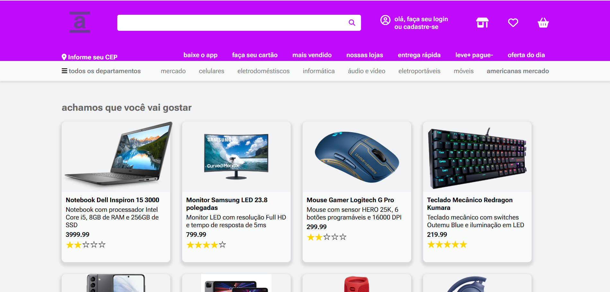

# Loja-cards

## Sobre

Este projeto foi desenvolvido com o objetivo de exercitar o uso de JSON na criação de cards de produtos, tomando como referência o modelo de uma loja virtual. A atividade foi proposta pelo professor Fernando Leonid na disciplina de Front-end, visando o aprendizado prático na manipulação de dados e sua aplicação na interface.

## Descrição
Simulando uma loja virtual que possui cards de produtos tecnologicos.
## Tecnologias

- JavaScritp
- JSON
- HTML
- CSS
- Responsividade
- Markdown

## Imagem

## Autor
 **[Breno Oliveira Assis Reis](https://www.linkedin.com/in/breno-oliveira-assis-reis-203010351/)**
